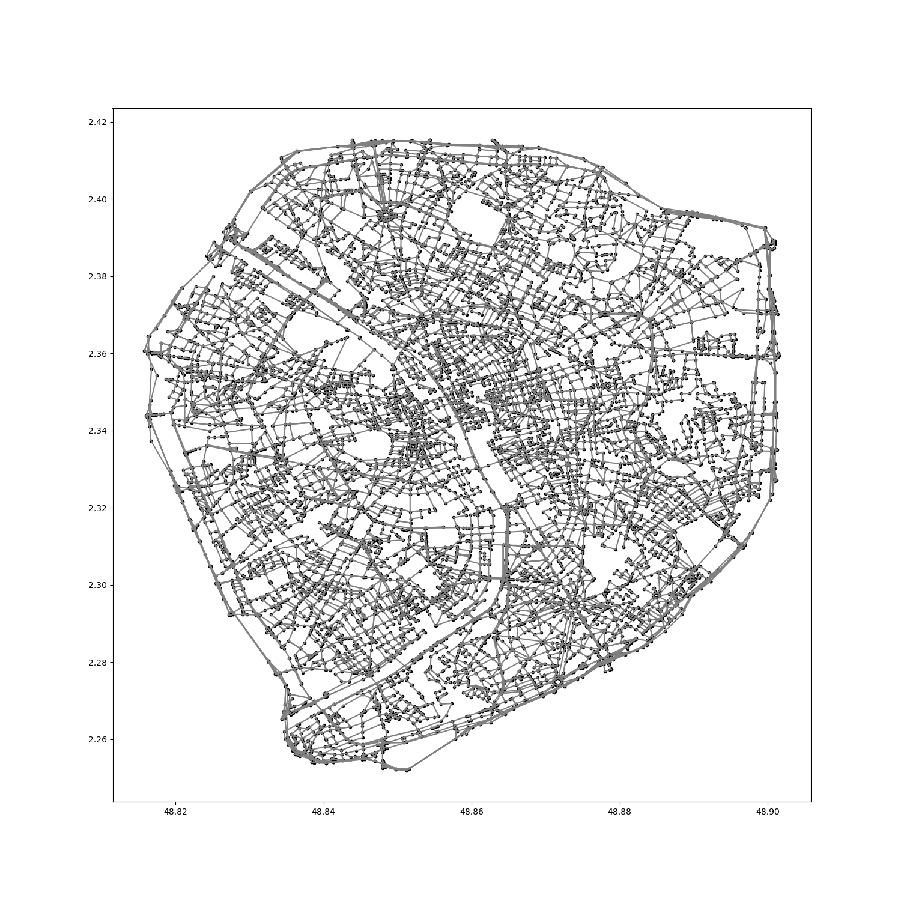

Route Inspection Problem
========================

Problem
-------
Undirected Route Inspection Problem: 
The delivery person has to travel across all Paris streets.
Aim is to minimize total distance with an associated delivery person path.
https://en.wikipedia.org/wiki/Route_inspection_problem

Environment
-----------
paris_map contains 2 datatypes.
* Vertex: introduced with its associated cartesian coordinates (x and y position)
* edge: is introduced with its 2 incident vertices number, plus distance, then the 2 associated vertices. 

Methodology
-----------
Problem is mathematically easy, i.e. solvable optimally in polynomial time using T-join problem algorithm. 
My solution isn't optimal as my program doesn't compute the best perfect complete graph.

First, graph modification:

* If the graph is eulerian, then the delivery person could pass by every edges and only once. Which is a optimal case.

* Graph surely isn't eulerian, so it needs to be changed to become one.

* A graph is eulerian if and only if all vertices have a even degree. Identification of odd degree vertice, objective is that new edges are added to the global graph so all vertices become of even degree

* Construction of a new complet graph made with all odd degree vertices. Distance of each edge is calculated using Dijkstra algorithm.

* Selection of a good (total distance minimized) perfect matching using a greedy algorithm. The perfect matching allows edge vertex to increase its degree by 1, making them become all even degree vertices on the global graph.

* Addition of the perfect matching to the global graph. Graph becomes eulerian

Second, path determination:

* determination of cycles: As the delivery man goes from one vertex to another, he will probably get stuck at vertex with no unused edge left locally, but globally sections are not treated. So iterations are needed, several cycles are created

* cycles assembly into an unique one

Progress
--------

Currently, algorithm runs, but isn't optimal due to the complete odd degree graph construction is a greedy algorithm and not an optimal one.
Animation of a chinese postman path runs, but it is not possible to save it due to matplotlib 3.2.1 bug. cf https://github.com/matplotlib/matplotlib/issues/16965

Noticable point
---------------

This project is not done using OOP, I didn't know how to do it on Python at the beginning.

